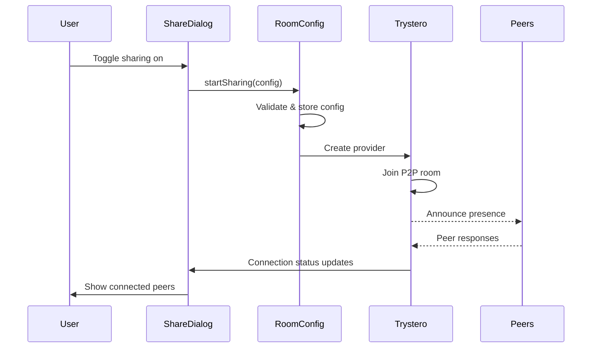
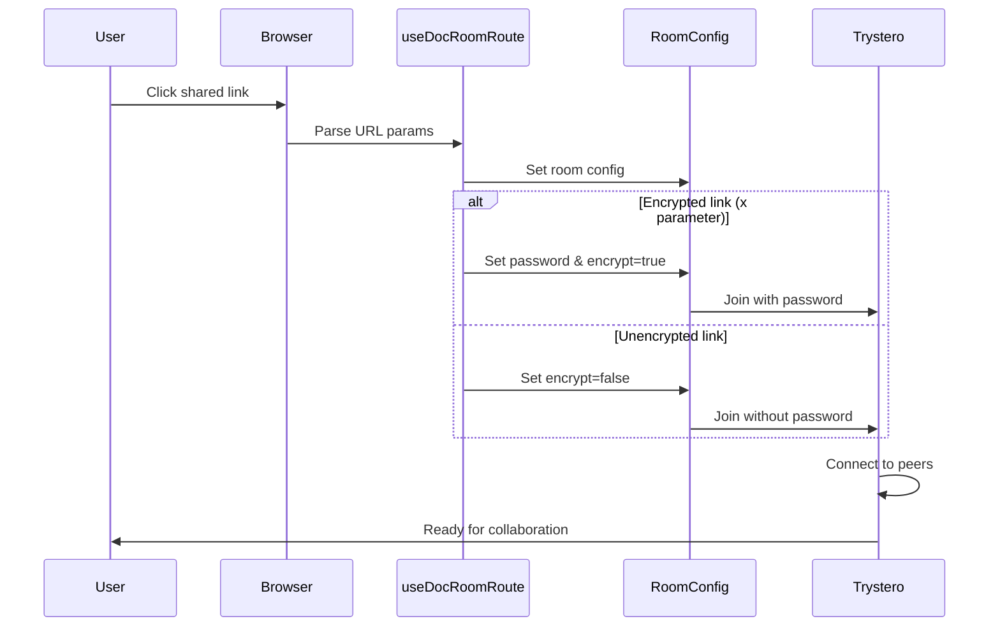

# Sharing Infrastructure Implementation

## Overview

The Y-Labs sharing infrastructure enables real-time collaborative editing across multiple editor applications (BlockSuite, Novel, CodeMirror, etc.) using Y.js for CRDT synchronization and Trystero for WebRTC-based peer-to-peer networking.

## Architecture

```
┌─────────────────┐    ┌──────────────────┐    ┌─────────────────┐
│   Editor Apps   │    │  Shared Hooks    │    │   Data Stores   │
│                 │◄──►│                  │◄──►│                 │
│ • BlockSuite    │    │ • useDocCollab   │    │ • doc-room-*    │
│ • Novel         │    │ • useDocRoom     │    │ • local-*       │
│ • CodeMirror    │    │ • useDocTitle    │    │ • doc-yjs       │
│ • etc.          │    │                  │    │                 │
└─────────────────┘    └──────────────────┘    └─────────────────┘
         │                       │                       │
         └───────────────────────┼───────────────────────┘
                                 │
                ┌────────────────────────────────┐
                │        ShareDialog             │
                │                                │
                │ • SharingToggle               │
                │ • SharingConfiguration        │
                │ • UserList                    │
                │ • SharingActions              │
                └────────────────────────────────┘
                                 │
                    ┌──────────────────────┐
                    │   Trystero P2P       │
                    │                      │
                    │ • WebRTC signaling   │
                    │ • End-to-end encrypt │
                    │ • Peer discovery     │
                    └──────────────────────┘
```

## Core Components

### 1. Document Storage (`src/app/shared/store/`)

#### `doc-yjs.ts`
- Manages Y.js documents for each editor
- Provides CRDT-based collaborative editing
- Handles document persistence to IndexedDB

#### `doc-room-config.ts`
- Stores room configuration (encryption, access level, passwords)
- Validates sharing parameters
- Generates sharing links
- **Key Interface:**
  ```typescript
  interface DocRoomConfigFields {
    docId: string;
    type: string;          // Editor type (blocksuite, novel, etc.)
    roomId: string;        // Unique room identifier
    enabled: boolean;      // Whether sharing is active
    encrypt: boolean;      // Require shared password
    password?: string;     // Shared password (when encrypt=true)
    accessLevel: "view" | "edit";
  }
  ```

#### `doc-room-trystero.ts`
- Manages Trystero WebRTC connections
- Handles peer discovery and awareness
- Coordinates Y.js provider with P2P networking
- **Key Features:**
  - Automatic reconnection on config changes
  - Peer awareness (cursors, user info)
  - Connection status tracking

### 2. Sharing Hooks

#### `useDocCollabStore.ts`
- Central hook for document collaboration
- Manages room state and configuration
- Provides `startSharing()` and `stopSharing()` methods
- **Returns:**
  ```typescript
  {
    ydoc: Y.Doc;
    docId: string;
    roomId: string;
    $room: DocRoomStore;
    provider: TrysteroProvider;
    $roomConfig: DocRoomConfigStore;
    startSharing: (config: DocRoomConfigFields) => void;
    stopSharing: () => void;
  }
  ```

#### `useDocRoomRoute.ts`
- Handles URL parameter parsing and room joining
- Processes encryption parameters (`x`, `encrypt`)
- Manages automatic room joining from shared links
- **URL Format:** `#/edit/{docId}/{type}?roomId={roomId}&encrypt=true&x={password}`

### 3. ShareDialog Components (Refactored)

The ShareDialog has been broken down into focused components:

#### `ShareDialog/ShareDialog.tsx`
- Main dialog container and orchestration
- Form management and validation
- Navigation handling

#### `ShareDialog/SharingToggle.tsx`
- Simple on/off toggle for sharing
- Triggers form submission or `stopSharing()`

#### `ShareDialog/SharingConfiguration.tsx`
- Room ID input with copy functionality
- Access level selector (view/edit)
- Encryption toggle (renamed to "Require shared password")
- Password input field (conditional)

#### `ShareDialog/SharingActions.tsx`
- Copy link button with animation
- Share/Stop sharing buttons

#### `ShareDialog/UserList.tsx`
- Shows connected peers
- User form for updating profile
- Awareness information display

#### `ShareDialog/UserForm.tsx`
- Username editing form
- Integrates with `$user` store

## Key Workflows

### 1. Starting a Sharing Session



### 2. Joining via Shared Link



## Recent Fixes

### 1. Passwordless Sharing Bug
**Issue:** Generated passwords appeared in links even when encryption was disabled.

**Root Cause:** 
- `ShareDialog.tsx:620` always included `x: password` parameter
- Default encryption was `true` for new rooms
- Password was always generated regardless of encryption setting

**Fix:**
- Changed default encryption to `false` for new rooms
- Fixed link generation: `x: encrypt ? password : undefined`
- Updated password generation: only generate when `encrypt=true`

### 2. Encryption Detection Issue
**Issue:** Clients required URL reload to connect to unencrypted rooms.

**Root Cause:**
- `useDocRoomRoute.ts` didn't properly clear passwords when `encrypt=false`
- Room config wasn't updated with correct encryption state
- Missing `type` parameter in room configuration

**Fix:**
- Clear password when `encrypt=false`: `password: encryptParam ? config.get().password : undefined`
- Added missing `type` parameter to room config
- Fixed URL parameter parsing logic

### 3. UI/UX Improvements
- Renamed "Encrypt communication" to "Require shared password" for clarity
- Added description to password field explaining its purpose
- Improved error handling in form validation
- Better default values for new sharing sessions

## Data Flow

### Store Relationships
```
$user (local-user.ts)
├── Username/color for awareness
└── Synced to Trystero awareness

$ydoc (doc-yjs.ts)
├── Y.js document instance
├── Persisted to IndexedDB
└── Shared via Trystero provider

$roomConfig (doc-room-config.ts)
├── Sharing configuration
├── Validation logic
└── Link generation

$room (doc-room-trystero.ts)
├── Trystero provider instance
├── Peer management
├── Connection status
└── Awareness synchronization
```

### Event Flow
1. User enables sharing → `startSharing()` called
2. Room config updated → Trystero provider created
3. Provider connects → Peers discovered
4. Awareness synchronized → User cursors/info shared
5. Document changes → Y.js CRDT synchronization
6. Changes propagated → All peers receive updates

## Configuration

### Environment Variables
- `appId`: Unique identifier for the Trystero network (see `store/constants.ts`)

### Trystero Configuration
```typescript
new TrysteroProvider(roomId, ydoc, { 
  appId: appId,
  joinRoom,
  password,           // Optional shared password
  accessLevel: "edit" | "view",
  awareness
})
```

### URL Parameters
- `roomId`: Room identifier
- `encrypt=true`: Indicates password required
- `x={password}`: Shared password (only when encrypted)

## Security Considerations

### Encryption
- **All connections use Trystero's built-in encryption by default**
- The "encrypt" option controls whether a **shared password is required**
- Password-protected rooms use additional encryption layer
- Passwords are shared via URL parameters (consider security implications)

### Privacy
- Document content never leaves the browser without explicit sharing
- P2P connections are direct between peers
- No central server stores document data
- IndexedDB provides local persistence

## Testing

### Manual Testing Checklist
- [ ] Create new document and enable sharing
- [ ] Copy link works correctly
- [ ] Passwordless sharing connects automatically  
- [ ] Password-protected sharing requires password
- [ ] Multiple peers can connect and edit
- [ ] Stopping sharing disconnects peers
- [ ] URL navigation works correctly
- [ ] Connection status updates properly

### Common Issues
- **Peer not connecting**: Check browser console for WebRTC errors
- **Password prompt loop**: Verify encryption parameters match
- **Changes not syncing**: Check Y.js provider connection status
- **Link not copying**: Verify clipboard permissions

## Future Improvements

### Near-term
- [ ] Better error handling and user feedback
- [ ] Connection quality indicators  
- [ ] Reconnection strategies
- [ ] Room persistence options

### Long-term
- [ ] Voice/video chat integration
- [ ] File attachment sharing
- [ ] Advanced permissions system
- [ ] Analytics and usage tracking

## API Reference

### Hooks
```typescript
// Main collaboration hook
useDocCollabStore(requireDocId?: boolean)

// URL parameter handling
useDocRoomRoute({ type?: string })

// Document metadata
useDocTitle()
useDocParams()
```

### Stores
```typescript
// Room configuration
getDocRoomConfig(docId: string, roomId: string)

// Trystero room management  
getTrysteroDocRoom(docId: string, roomId: string)

// Y.js document
getYdoc(docId: string)

// User settings
$user (global store)
```

### Utils
```typescript
// Link generation
generateSharingLink(config: DocRoomConfigFields, type?: string)
generateDocRoomRouterLink(config: DocRoomConfigFields, type?: string)

// ID generation
generateId(): string
```

---

This implementation provides a robust foundation for real-time collaborative editing with flexible encryption options and a clean component architecture. The recent fixes address the core issues around passwordless sharing and connection reliability.